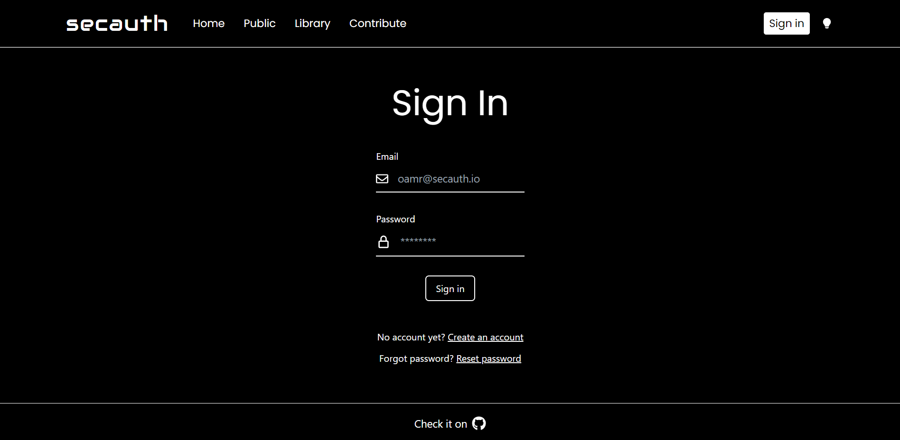
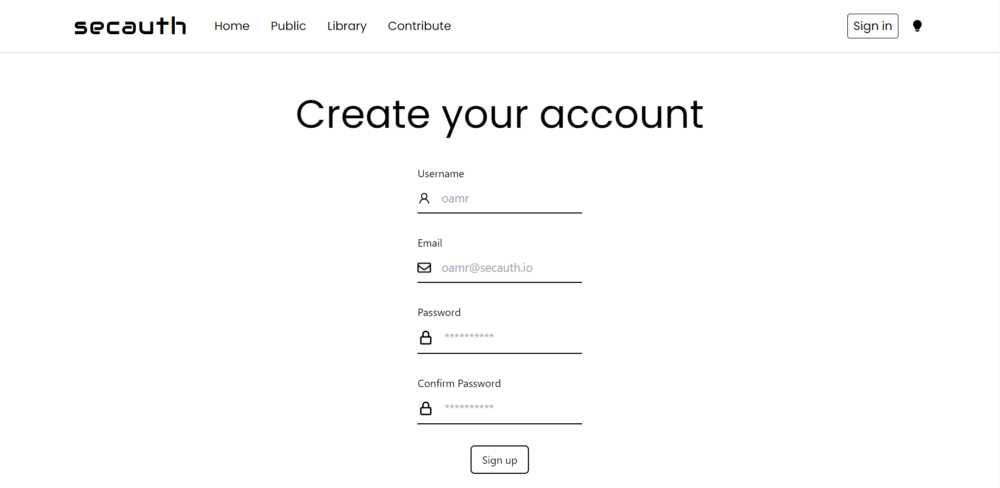

# Secauth

Attempt to make a website with secure user authentication inspired from [OWASP Top Ten guidelines](https://owasp.org/www-project-top-ten/).

# Demo (light/dark theme)




## Building It

Note: Make sure you have node version 16+ selected.

1. Replace the contents in `server/.env_sample` with your own and rename the file to `server/.env`.

2. Run server:

```bash
cd server
npm run build
npm run start
```

3. Run client:

```bash
cd client
npm run build
npm run start
```

4. Go to localhost:3000 to view the website.

## Main Technologies Used

Typescript. ReactJS. NextJS. MongoDB. TailwindCSS.
